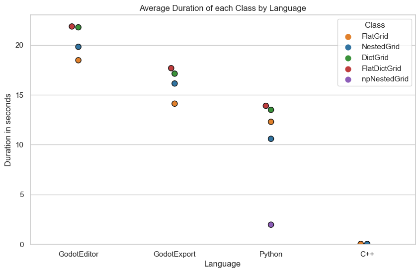

# Matrix Addition Optimizations in Godot

## Project Overview

This repository contains a Godot project and several python and C++ files, all aimed at addressing the challenge of efficiently adding matrices of different sizes and with positional offsets. The project is dedicated to optimizing matrix calculations in the Godot Engine, exploring various data structures and algorithms in different languages to compare their performance on the way.

## Problem Statement

Matrices are ubiquitous in game development, representing transformations such as translation, rotation, or scaling. Typically, operations like addition or subtraction require matrices of the same size due to element-wise calculations. However, I recently encountered a scenario where I had to add matrices of different sizes and with positional offsets. Godot lacked an out-of-the-box solution for this, so I decided to make one. 
Implementing this operation in Godot's scripting language, GDScript, involves a two-step process. First, determining the overlapping area of the matrices and subsequently adding the corresponding values within this intersection. Despite my appreciation for GDScript's user-friendly and rapid development capabilities, it's essential to acknowledge its relative performance limitations in certain scenarios. Dealing with nested loops like when adding the values in the second step is one of these scenarios. Notably, Godot offers a solution through the integration of engine modules in the form of dynamic C++ libraries. 
This project serves as a comprehensive exploration of performance discrepancies between GDScript and C++, as well as the influence of different data structures when addressing matrix addition. Out of personal interest, the project also ventures into the realm of data vectorization in Python, using NumPy to achieve performance enhancements in a scripted language. The primary objective is to develop an optimized C++ solution, effectively creating a module for Godot.

## Approach

The objective is to compare and optimize different methods for adding matrices. To achieve this, the following approach was undertaken:

1. **Data Structure Evaluation in Godot**: The impact of data structure choices on performance was a primary focus. Various versions of a `Grid` class were crafted, utilizing a dictionary, a one-dimensional array, or a two-dimensional array structures to house matrix values.
2. **Intersection Algorithm in Godot**: For each matrix addition operation, the initial task was to identify the overlapping regions between the matrices. A custom intersection algorithm was devised. The performance of this custom algorithms was compared with the intersection method provided by Godot's `Rect2i` class, a C++ implementation.
3. **Python Naive Replication**: To gauge performance variations in a distinct context, the Godot classes for evaluating data structure efficiency were replicated in Python using a straightforward approach, without external packages.
4. **Numpy Vectorization**: Leveraging the power of the Python numerical computing library, Numpy, data structures were vectorized. This vectorization was subsequently evaluated against previous implementations, highlighting potential performance enhancements.
5. **C++ Implementation**: Finally, to identify the otimal data structure and to compare the results of dynamic languages to the optimization of a compiled language, the classes were reimplemented in C++.

## Results

Adding a 9x9 grid to every cell of a 600x600 grid. The center of the 9x9 grid is located at the target cell. Duration is the mean of 30 repetitions.

| Language | Class | Duration |
|----------|----------|----------|
| GodotEditor  | FlatDictGrid  | 21.851 s  |
| GodotEditor  | DictGrid  | 21.768 s  |
| GodotEditor  | NestedGrid  | 19.812 s  |
| GodotEditor  | FlatGrid  | 18.465 s  |
| GodotExport  | FlatDictGrid  | 17.669 s  |
| GodotExport  | DictGrid  | 17.121 s  |
| GodotExport  | NestedGrid  | 16.132 s  |
| GodotExport  | FlatGrid  | 14.111 s  |
| Python  | FlatDictGrid  | 13.895 s  |
| Python  | DictGrid  | 13.49 s  |
| Python  | FlatGrid  | 12.288 s  |
| Python  | NestedGrid  | 10.583 s  |
| Python  | npNestedGrid  | 1.97 s  |
| C++  | FlatGrid  | 0.045 s  |
| C++  | NestedGrid  | 0.038 s |
